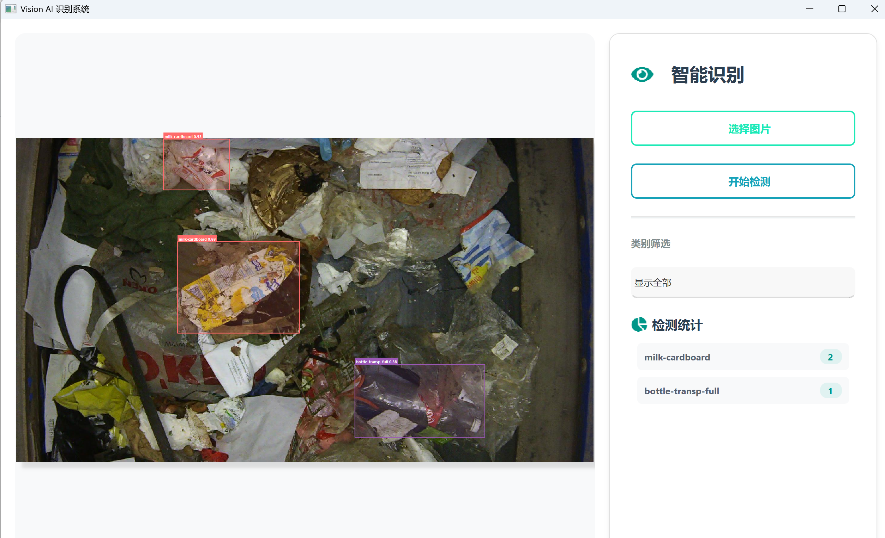

# YOLOv11 Object Detection System: Training & Modern GUI




本项目提供了一套完整的 YOLOv11 目标检测系统，包含：
- 🎯 **自动化训练流程**：VOC → YOLO 格式转换、数据集划分、模型训练
- 🎨 **现代化推理界面**：PyQt5 + qt-material 打造的清新简约 GUI
- 🚀 **开箱即用**：提供完整代码、详细文档和故障排查指南

---

## 📋 目录

1. [项目简介](#项目简介)
2. [环境依赖](#环境依赖)
3. [项目结构](#项目结构)
4. [Part 1: 数据预处理与模型训练](#part-1-数据预处理与模型训练)
5. [Part 2: 现代化推理 GUI](#part-2-现代化推理-gui)
6. [应用演示](#应用演示)
7. [快速开始](#快速开始)
8. [故障排查](#故障排查)
9.  [常见问题](#常见问题)

---

## 项目简介

### 核心功能

#### 🔧 训练模块 (`train_pipeline.py`)
自动化的数据处理和模型训练流程：
- 📁 自动扫描 VOC 格式 XML 注解文件
- 🔄 实时坐标转换：`(xmin, ymin, xmax, ymax)` → `(x_center, y_center, width, height)`
- 📊 自动化数据集划分（支持自定义训练/验证比例）
- ⚙️ 自动生成 YOLO 配置文件 (`voc2012.yaml`)
- 🎓 一键启动 YOLOv11 模型训练

#### 🎨 GUI 模块 (`modern_app.py`)
现代化的推理展示界面：
- 🖼️ 支持多格式图片导入 (PNG, JPG, JPEG, BMP)
- 🎯 实时目标检测和标记
- 🏷️ 交互式检测框（悬停高亮、点击查看详情）
- 📈 实时统计面板（类别统计）
- 🔍 按类别过滤检测结果
- 🌈 清新莫兰迪配色方案

---

## 环境依赖

### Python 版本要求
- **Python 3.8+**

### 安装依赖

```bash
# 1. 创建虚拟环境（可选）
python -m venv venv
source venv/bin/activate  # Linux/Mac
# 或
venv\Scripts\activate  # Windows

# 2. 升级 pip
pip install --upgrade pip

# 3. 安装核心依赖
pip install numpy>=1.21.0 pandas>=1.3.0 opencv-python>=4.5.0 scikit-learn>=1.0. 0 pillow>=8.3.0

# 4. 安装 YOLOv11
pip install ultralytics

# 5. 安装 GUI 依赖
pip install PyQt5>=5.15.0 qt-material>=2.14 qtawesome>=1.1.0
```

或者一条命令安装全部：

```bash
pip install numpy pandas opencv-python scikit-learn pillow ultralytics PyQt5 qt-material qtawesome
```

---

## 项目结构

```
yolov11-detection-system/
├── README.md                    # 本文档
├── train_pipeline.py            # 训练模块（VOC→YOLO 转换 + 模型训练）
├── modern_app.py                # GUI 推理模块
├── requirements.txt             # 依赖列表
├── best. pt                      # 训练好的模型权重（需自行训练或下载）
└── data/
    ├── VOC2012/                 # VOC 数据集目录
    │   ├── Annotations/         # XML 标注文件
    │   ├── JPEGImages/          # 图片文件
    │   └── yolo_format/         # YOLO 格式输出目录
    └── sample_images/           # 示例图片
```

---

## Part 1: 数据预处理与模型训练

### 📌 核心流程

1. **扫描 XML 文件** → 2. **解析标注信息** → 3. **坐标归一化** → 4. **数据集划分** → 5. **生成 YAML** → 6. **启动训练**

### 训练代码 (`train_pipeline.py`)

```python
import os
import pandas as pd
import numpy as np
import xml.etree.ElementTree as ET
from sklearn.preprocessing import LabelEncoder
from ultralytics import YOLO
import cv2

# ===================== 1. 定义路径 =====================
# ⚠️ 重要：请根据实际环境修改 BASE_PATH
BASE_PATH = "F:/archive(11)/VOC2012"  
XML_PATH = os.path.join(BASE_PATH, "Annotations")
IMG_PATH = os.path.join(BASE_PATH, "JPEGImages")
YOLO_DATA_PATH = os.path.join(BASE_PATH, "yolo_format")

# 创建必要的目录
os.makedirs(YOLO_DATA_PATH, exist_ok=True)
os.makedirs(os.path.join(YOLO_DATA_PATH, "images", "train"), exist_ok=True)
os.makedirs(os.path.join(YOLO_DATA_PATH, "labels", "train"), exist_ok=True)
os.makedirs(os.path.join(YOLO_DATA_PATH, "images", "val"), exist_ok=True)
os.makedirs(os.path.join(YOLO_DATA_PATH, "labels", "val"), exist_ok=True)


# ===================== 2. XML 解析工具类 =====================
class XmlParser:
    """
    解析 VOC 格式 XML 标注文件
    
    属性:
        xml_file (str): XML 文件路径
        img_path (str): 对应的图片路径
        image_id (str): 图片 ID
        width (int): 图片宽度
        height (int): 图片高度
    """
    def __init__(self, xml_file):
        self.xml_file = xml_file
        self.root = ET.parse(xml_file).getroot()
        self.objects = self.root.findall("object")
        self.img_path = os.path.join(IMG_PATH, self.root.find('filename').text)
        self. image_id = self.root. find("filename").text
        self.width = int(self.root.find("size/width").text)
        self.height = int(self.root.find("size/height").text)

    def get_names(self):
        """获取所有类别名称"""
        names = []
        for obj in self.objects:
            names.append(obj.find("name").text)
        return np.array(names)

    def get_boxes(self):
        """
        获取所有边界框坐标（VOC 格式）
        
        返回:
            np.array: [xmin, ymin, xmax, ymax] 坐标数组
        """
        boxes = []
        for obj in self. objects:
            bndbox = obj.find("bndbox")
            # 先转 float 再转 int，处理浮点数坐标
            xmin = int(float(bndbox.find("xmin").text))
            ymin = int(float(bndbox.find("ymin").text))
            xmax = int(float(bndbox.find("xmax").text))
            ymax = int(float(bndbox.find("ymax").text))
            boxes.append([xmin, ymin, xmax, ymax])
        return np.array(boxes)


# ===================== 3. VOC 转 YOLO 格式（坐标归一化） =====================
def voc_to_yolo(xml_files, train_ratio=0.8):
    """
    将 VOC 格式数据集转换为 YOLO 格式
    
    参数:
        xml_files (list): XML 文件路径列表
        train_ratio (float): 训练集比例 (默认 0.8)
    
    返回:
        str: YAML 配置文件路径
    
    处理步骤:
        1. 收集所有类别并建立标签编码器
        2. 划分训练/验证集
        3. 逐个转换文件格式
        4. 生成 YAML 配置文件
    """
    # 收集所有类别
    all_classes = []
    for file in xml_files:
        parser = XmlParser(file)
        all_classes.extend(parser.get_names())
    all_classes = list(set(all_classes))
    
    # 建立标签编码器
    label_encoder = LabelEncoder()
    label_encoder.fit(all_classes)
    
    print(f"[INFO] 发现 {len(all_classes)} 个类别: {all_classes}")

    # 划分训练/验证集
    np.random.shuffle(xml_files)
    train_files = xml_files[:int(len(xml_files) * train_ratio)]
    val_files = xml_files[len(train_files):]
    
    print(f"[INFO] 训练集: {len(train_files)} | 验证集: {len(val_files)}")

    # 生成 YOLO 格式标签和图像
    for phase, files in [("train", train_files), ("val", val_files)]:
        print(f"\n[Processing] 处理 {phase} 集合...")
        for idx, file in enumerate(files):
            parser = XmlParser(file)
            img = cv2.imread(parser.img_path)
            if img is None:
                print(f"[WARNING] 无法读取图片: {parser.img_path}")
                continue
            
            h, w = img.shape[:2]
            labels = []
            
            # 转换每个目标的坐标
            for name, box in zip(parser.get_names(), parser.get_boxes()):
                xmin, ymin, xmax, ymax = box
                
                # VOC 坐标 → YOLO 归一化坐标
                # x_center = (xmin + xmax) / 2 / width
                # y_center = (ymin + ymax) / 2 / height
                # width = (xmax - xmin) / width
                # height = (ymax - ymin) / height
                x_center = (xmin + xmax) / 2 / w
                y_center = (ymin + ymax) / 2 / h
                width = (xmax - xmin) / w
                height = (ymax - ymin) / h
                
                # 获取类别 ID
                class_id = label_encoder.transform([name])[0]
                
                # 格式: class_id x_center y_center width height
                labels.append(f"{class_id} {x_center:.6f} {y_center:.6f} {width:.6f} {height:.6f}")

            # 保存图像和标签
            img_save_path = os.path.join(YOLO_DATA_PATH, "images", phase, parser.image_id)
            label_save_path = os.path.join(YOLO_DATA_PATH, "labels", phase,
                                           os.path.splitext(parser. image_id)[0] + ". txt")
            
            cv2.imwrite(img_save_path, img)
            with open(label_save_path, "w") as f:
                f.write("\n".join(labels))
            
            if (idx + 1) % 100 == 0:
                print(f"  已处理: {idx + 1}/{len(files)}")

    # 生成 YOLO 配置文件（yaml）
    yaml_content = f"""path: {YOLO_DATA_PATH}
train: images/train
val: images/val

nc: {len(all_classes)}
names:
{chr(10).join([f"  {i}: {cls}" for i, cls in enumerate(label_encoder.classes_)])}"""
    
    yaml_path = os.path.join(YOLO_DATA_PATH, "voc2012.yaml")
    with open(yaml_path, "w", encoding='utf-8') as f:
        f.write(yaml_content)
    
    print(f"\n[SUCCESS] YAML 配置文件已生成: {yaml_path}")
    return yaml_path


# ===================== 4. 执行格式转换并训练 YOLOv11 =====================
if __name__ == '__main__':
    print("=" * 60)
    print("YOLOv11 VOC2012 数据集自动化训练流程")
    print("=" * 60)
    
    # 获取所有 XML 文件
    XML_FILES = [os.path.join(XML_PATH, f) for f in os. listdir(XML_PATH) if f.endswith(". xml")]
    print(f"\n[INFO] 找到 {len(XML_FILES)} 个 XML 标注文件")
    
    if len(XML_FILES) == 0:
        print("[ERROR] 未找到 XML 文件，请检查路径设置！")
        exit(1)
    
    # 转换数据格式
    print("\n[STEP 1] 开始数据格式转换...")
    yaml_path = voc_to_yolo(XML_FILES, train_ratio=0.8)
    
    # 启动模型训练
    print("\n[STEP 2] 启动 YOLOv11 模型训练...")
    model = YOLO("yolo11s.pt")
    
    # 训练参数说明：
    # - data: 配置文件路径
    # - epochs: 训练轮数
    # - batch: 批次大小（根据 GPU 内存调整）
    # - workers: 数据加载线程数
    # - imgsz: 输入图像尺寸
    # - device: 设备 (0 表示 GPU0, 可设为 CPU)
    model.train(
        data=yaml_path,
        epochs=150,
        batch=1,              # 根据显存调整 (1/2/4/8/16...)
        workers=0,
        imgsz=640,
        device=0              # GPU 设备 ID
    )
    
    print("\n[COMPLETE] 训练完成！")
    print(f"模型已保存至: runs/detect/train/weights/best. pt")
```

### 📖 使用说明

**第一步：准备数据**
```bash
# 确保你的 VOC 数据集结构如下：
# VOC2012/
# ├── Annotations/     (XML 文件)
# └── JPEGImages/      (图片文件)
```

**第二步：修改路径**
编辑 `train_pipeline.py`，修改第 14 行：
```python
BASE_PATH = "你的VOC数据集路径"  # 例如: "D:/datasets/VOC2012"
```

**第三步：运行训练**
```bash
python train_pipeline.py
```

---

## Part 2: 现代化推理 GUI

### 🎨 界面特色

| 特性 | 说明 |
|------|------|
| 🌈 **清新主题** | Light Teal qt-material 主题 + 白色卡片式布局 |
| 🖱️ **交互优化** | 检测框悬停高亮、点击查看详情 |
| 📊 **实时统计** | 类别统计面板自动更新 |
| 🔍 **类别过滤** | 按类别显示/隐藏检测结果 |
| 🎯 **矢量图标** | FontAwesome 图标美化 UI |

---

## 应用演示

### 应用主界面示例

下图展示了现代化识别系统的主界面，清新的 Light Teal 主题、卡片式布局和直观的操作面板一目了然：


**界面说明：**
- 📸 **左侧画布**：显示加载的图片，支持鼠标拖拽平移、滚轮缩放
- 🎯 **检测框**：彩色矩形框标注检测目标，显示类别和置信度
- 🎨 **右侧控制面板**：
  - "选择图片" 按钮：导入新图片
  - "开始检测" 按钮：执行目标检测
  - "类别筛选"：按类别显示/隐藏检测结果
  - "检测统计"：实时显示各类别检测数量

### 检测结果可视化示例

下图展示了在垃圾分类数据上的实时检测效果，不同类型的垃圾用不同颜色的边框高亮标注，并显示对应的类别名称和置信度值：


**检测特性：**
- ✅ **多目标检测**：同时检测图像中的多个对象
- 🎯 **精确定位**：边框紧密环绕目标
- 📊 **置信度显示**：每个检测框上方显示类别和置信度
- 🌈 **彩色区分**：不同类别使用不同颜色便于区分

---

## 快速开始

### 方式一：快速演示（不需要训练）

```bash
# 1. 克隆/下载项目
git clone https://github.com/JohnMonroe4470/yolov11-detection-system.git
cd yolov11-detection-system

# 2. 安装依赖
pip install -r requirements.txt

# 3. 下载预训练模型
# 自动下载：运行时如果没有 best.pt，会自动使用 yolo11s.pt

# 4. 运行推理 GUI
python modern_app.py
```

### 方式二：完整流程（从数据训练到推理）

```bash
# 1-2 同上

# 3. 准备 VOC 数据集
# 修改 train_pipeline.py 中的 BASE_PATH 为你的数据集路径

# 4. 训练模型
python train_pipeline.py

# 5. 推理
python modern_app. py
```

---

## 故障排查

### ❌ 问题 1: TypeError: setPen() 报错

**错误消息：**
```
TypeError: setPen(self, pen: Union[QPen, Union[QColor, Qt.GlobalColor]]): 
argument 1 has unexpected type 'PenStyle'
```

**原因：** 代码中使用 `Qt.NoPen` 直接作为参数，但 `QPen()` 需要一个 `QPen` 对象。

**解决方案：**
```python
# ❌ 错误
self.text_bg. setPen(Qt.NoPen)

# ✅ 正确
self.text_bg.setPen(QPen(Qt.NoPen))
```

**修复位置：** `modern_app.py` 第 79 行

---

### ❌ 问题 2: qt. svg 资源加载警告

**警告信息：**
```
qt.svg: Cannot open file 'D:/path/icon:/active/downarrow.svg'
```

**原因：** `qt-material` 库在 Windows 上的已知路径拼接 Bug。

**影响：** **无实质影响**，仅控制台输出，界面功能正常。

**处理方法：**
- ✅ 方法 1：忽略警告（推荐）- 不影响使用
- 方法 2：在脚本前添加环境变量过滤（高级）

```python
import os
os.environ['QT_QPA_PLATFORM_PLUGIN_PATH'] = ''
```

---

### ❌ 问题 3: 模型加载失败

**错误信息：**
```
FileNotFoundError: [Errno 2] No such file or directory: './best.pt'
```

**原因：** 找不到训练好的模型文件。

**解决方案：**
```python
# 方法 1：指定完整路径
self.model = YOLO("D:/your_path/best.pt")

# 方法 2：使用预训练模型
self.model = YOLO("yolo11s.pt")  # 自动下载

# 方法 3：指定本地下载的模型
self.model = YOLO("yolo11m.pt")  # yolo11n/s/m/l/x 可选
```

---

### ❌ 问题 4: 数据集转换失败

**症状：** 运行 `train_pipeline.py` 后没有生成 YOLO 格式文件。

**排查步骤：**

1. **检查路径：**
```python
import os
BASE_PATH = "F:/archive(11)/VOC2012"
print(os.path.exists(os.path.join(BASE_PATH, "Annotations")))  # 应输出 True
print(os.path. exists(os.path.join(BASE_PATH, "JPEGImages")))   # 应输出 True
```

2. **检查 XML 文件：**
```bash
ls F:/archive(11)/VOC2012/Annotations/*. xml  # Linux/Mac
dir F:\archive(11)\VOC2012\Annotations\*.xml  # Windows
```

3. **运行调试版本：**
```python
# 在 train_pipeline.py 主函数中添加
XML_FILES = [...]
print(f"Found {len(XML_FILES)} XML files")
if len(XML_FILES) > 0:
    print(f"First file: {XML_FILES[0]}")
```

---

## 常见问题

### Q1: 为什么检测速度这么慢？

**A:** 
- 🐢 使用了 `batch=1` 的设置（节省显存），可改为 `batch=16` 或更大
- 🖥️ 使用 CPU 推理，建议使用 GPU（CUDA）
- 📦 模型太大，可使用 `yolo11n.pt` (nano 版本) 替代

**建议修改：**
```python
model. train(
    batch=8,  # 增加批次大小
    device=0  # 使用 GPU
)
```

---

### Q2: 如何训练自己的数据集？

**A:** 
1. 准备 VOC 格式的标注数据（XML 文件）
2.  修改 `train_pipeline.py` 中的 `BASE_PATH`
3. 运行 `python train_pipeline.py`
4. 等待训练完成

---

### Q3: 检测框样式可以自定义吗？

**A:** 当然可以！修改 `modern_app.py` 中的：

```python
# 修改检测框颜色（第 263 行）
COLORS = [
    "#FF6B6B", "#4ECDC4", "#45B7D1",  # 添加更多颜色
    # ... 
]

# 修改框线宽度（第 79 行）
pen = QPen(QColor(color), 2. 5)  # 改为需要的宽度

# 修改框填充透明度（第 76 行）
c.setAlpha(40)  # 改为 0-255 之间的值
```

---

### Q4: 支持实时摄像头检测吗？

**A:** 当前版本仅支持图片检测。添加摄像头支持可参考以下代码：

```python
import cv2

def camera_inference(self):
    cap = cv2. VideoCapture(0)
    while True:
        ret, frame = cap.read()
        if not ret: break
        
        results = self.model. predict(frame)
        # 处理检测结果... 
        
        cv2.imshow('Detection', frame)
        if cv2.waitKey(1) & 0xFF == ord('q'):
            break
    cap.release()
    cv2. destroyAllWindows()
```

---

## 贡献指南

欢迎提交 Issue 和 Pull Request！

---

## 许可证

本项目采用 **MIT License** 开源许可证。详见 [LICENSE](LICENSE) 文件。

---

## 联系方式

- 📧 Email: [1561363371@qq.com]

---

## 致谢

感谢以下开源项目的支持：
- [Ultralytics YOLOv11](https://github.com/ultralytics/ultralytics)
- [PyQt5](https://www.riverbankcomputing.com/software/pyqt/)
- [qt-material](https://github.com/UN-GCPDS/qt-material)
- [QtAwesome](https://github.com/spyder-ide/qtawesome)

---

**最后更新时间：** 2025-12-05  
**当前版本：** v1. 0.0